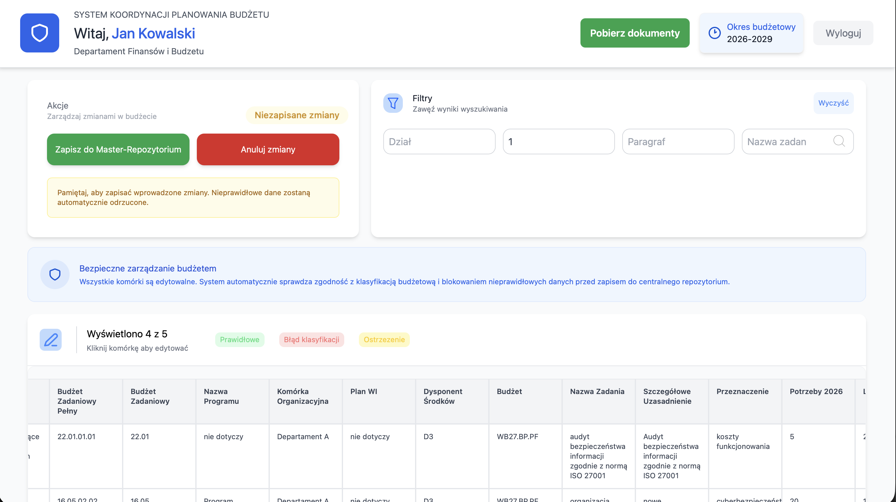

# HackNation

# System Koordynacji Planowania Budżetu

## Bezpieczne rozwiązanie dla administracji publicznej

Koniec Chaosu Excela. Precyzyjne Planowanie Budżetu na 4 Lata.

System Koordynacji Planowania Budżetu zapewnia pełną kontrolę, bezpieczeństwo danych i zgodność z przepisami. Transformacja cyfrowa bez ryzyka.

---

## 📋 Zrzuty ekranu

### Strona główna


### Panel zarządzania budżetem


### Edycja danych z filtrami



---

## ✨ Główne funkcjonalności

- **Odporność na błędy** - Automatyczna walidacja danych
- **Bezpieczeństwo** - Segmentacja uprawnień
- **Zgodność prawna** - Walidacja klasyfikacji budżetowej

---

## Instalacja

### Wymagania

- Node.js (v14+)
- npm lub yarn

### Kroki instalacji

1. **Klonuj repozytorium**

```bash
git clone <URL_REPOZYTORIUM>
cd hackathonNowy/frontend
```

2. **Zainstaluj zależności**

```bash
npm install
```

3. **Uruchom aplikację**

```bash
npm start
```

Aplikacja otworzy się na `http://localhost:3000`

### How to run backend locally:

navigate to /server
docker-compose up --build
api should now run on http://localhost:8080/
view docs and test at http://localhost:8080/scalar/v1

### Struktura projektu

```
src/
├── components/      # Komponenty React (Header, Footer)
├── context/        # Kontekst aplikacji (UserContext)
├── pages/          # Strony aplikacji
├── assets/         # Grafiki i ikony
└── App.jsx         # Główny komponent
```

### Funkcjonalności

- 🔐 Logowanie użytkowników
- 📊 Zarządzanie budżetem z edycją komórek
- 🔍 Filtrowanie danych
- 📥 Pobieranie dokumentów
- 💾 Zapisywanie zmian

### Technologie

- React
- React Router
- Context API
- Tailwind CSS

### Kontakt

W przypadku problemów skontaktuj się z zespołem.
